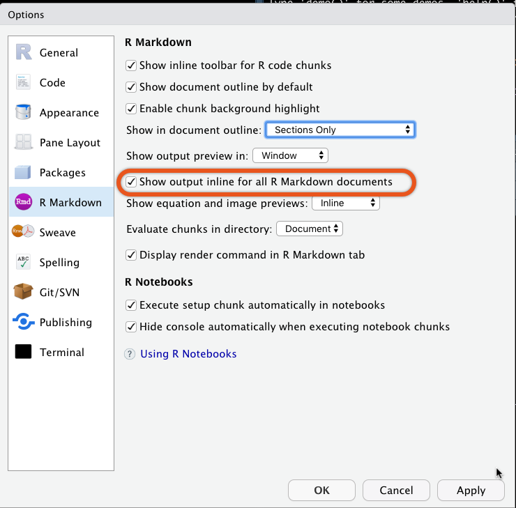
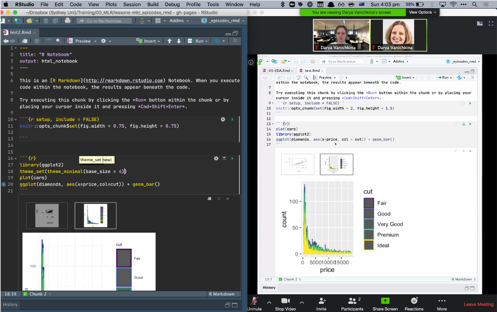

With the advent of COVID-19 we’re all having to do the unthinkable, which for an instructor like me means moving hands-on, practical coding workshops online. In this post, I'll provide a map that helped me formalise how I broke down our workshops into components, and tried to map each of them to an online tool, platform or approach. I've used Zoom for most of the examples below, since that's what I've used for teaching, but I'm sure that most of this functionality is well supported by other online meeting tools.

## Preliminaries

A learners arrives in my training room. They:

1. **Sign in on a sign-in sheet**
   - The "Host" can take a screenshot of all of the participants, in gallery view, and/or a list of the names of Participants, approximately 30 minutes after the session begins[^1].
2. **Make a name tag for themselves**
    - Rename themselves in Zoom to their preferred name, faculty or school (depending on teaching cohort) and preferred pronoun, so I'd become, for example "Darya (SIH, she/her)".
    - This can sometimes make it tricky to match names to emails, which is what we use as our unique key for registration. That's why I try to check people in during the day, and clarify with a private chat message asking what someone's email is if I'm unable to unambiguously match them to their email.
3. **Find a seat**
   - There are several ways to allocate learners to a breakout room. First, you can use the faculty details in the naming convention above to group people by discipline, school or faculty.
      - *This can present challenges downstream if a particular aspect of your course is better aligned with one domain's background knowledge than another's. For example, I use a problem with cancer patients and controls, which for me (and most people with a biomedical background) obviously indicates that the latter group are healthy, possibly/ideally age/gender matched people without cancer. When I grouped people by Faculty, the life and health sciences team powered through the challenge, whereas the engineers ended up spending a lot of time wrapping their heads around what a control was in this context.*
      - So in the future I think I'll stick to what happens in real life, and mix people by first letter of name or order of popping into the course, similar to how learners tend to randomly sit together in a 3D classroom. 

## Workshop start

1. **Chat to their neighbours**
    - In a 3D workshop this is part of the preliminaries, but you as the instructor have to actively normalise this online.
    - It's one of the hardest things to replicate: the productive interactions and relationship-building/networking among learners that happens when you work together on a bunch of tasks for 2 days straight. 
     - A somewhat useful replacement that gets learners talking is an icebreaker task ([ideas here](https://carpentries.github.io/instructor-training/icebreakers/)), which can either be posted into the shared document OR carried out orally in small groups in breakout rooms. I find it helpful, in addition to asking about something relatable ("What was the most interesting thing you learned working from home last week?") to ask about learners' setups and screens ("What does your learning setup look like today?"). That way, I can suggest tweaks, such as logging in from a mobile device as a modification of a two screen setup. Another option is to ask the latter [as a poll](https://support.zoom.us/hc/en-us/articles/213756303-Polling-for-Meetings). 

2. **Code of Conduct**
    - All workshops need a [Code of Conduct](https://sydney-informatics-hub.github.io/codeofconduct/), which establishes the norms of behaviour you expect to support everyone's learning. Online, I add information about expectations for private messaging and screen sharing, as well as recording (nope!).
    - I also ask people to let me know (via a private chat message, at any point in the workshop) if they're uncomfortable with me explicitly calling on them, as one of the biggest challenges of teaching online (and off) is extroverts dominating the conversation. To prevent this, I keep a tally of who I've called on, but I also want to make sure I don't make someone who's wrangling a child or responding to 50 emails about a grant deadline to feel uncomfortable or pressured.
    
3. **Schedule**
    - Just like a "normal" class, I use a slide to walk learners through the schedule, explain how the course content is linked and when breaks will happen. 

4. **Sticky notes**
    - In a Carpentries workshop, we have a very special way of using [sticky notes](https://dynamicecology.wordpress.com/2015/01/13/sticky-notes-as-a-teaching-and-lab-meeting-tool/) to gauge learner state and assess who needs help - without them having to hold their hand up for hours. Zoom is great because it's a digital platform that allows us to replicate the same - BUT it's important to recognise that using this feature in Zoom costs screen real estate (and cognitive load!), so may need to be relied on sparingly during some portions of the class, especially the live coding ones!
   - To replicate stickies in Zoom you can use the **[Non-verbal Feedback](https://support.zoom.us/hc/en-us/articles/115001286183-Non-verbal-Feedback-During-Meetings) functionality**:

  - While there are a LOT of options, we tended to use only the "Hand up", "Yes" and "No" options, as (1) you can only use one of these statuses at a time, and (2) we wanted to know whether students were good ("Yes"), needed a helper to reach out ("No"), or wanted to ask a question ("Hand"). The Hand functionality is also quite helpful for the instructor, as it automatically places the person with the hand up at the top left in Gallery view mode.

   - I'll also mention [**Reactions**](https://support.zoom.us/hc/en-us/articles/360038311212-Meeting-reactions) here, which unlike Non-verbal feedback are a non-persistent way learners can tell you that all is good: they're displayed on screen for 5 seconds, and are overlaid *over* a learners picture in Gallery view. You can only show "thumbs up"  or "clap", so they're not very helpful for getting negative feedback.  Our learners used them intuitively, without us providing explicit instructions, to  let us know that they didn't have any questions during the frequent pauses we made to ask "Does anyone have any questions?/Are there any questions?/What's unclear about what we just did?".
  

## Slide-centric sessions

In some of our intermediate sessions, we then dive into slides, with a small slide deck (20 minutes max) that provides some theory and a few conceptual challenge tasks. With these sessions, I

1. Start by showing learners how best to set up their screens for learning, including if they want to take notes or ask questions via the chat.

2. Make sure I explicitly provide a link to where they can download the slides, so they can annotate a copy as we go, on their own machine.

3. Set up the norms of asking questions: use the chat (or the shared doc, but ideally not both), and have my hosting co-instructor interrupt me during short pauses if I miss a question that a learner asked that would be best answered during that particular slide/mini-session vs at the end of the presentation.

## Live coding sessions

These form the core of our workshops, with sessions of coding along interspersed with short, formative assessment tasks, including multiple choice questions, faded examples and more complex, unscaffolded challenge tasks. Live coding is the most challenging aspect to "port" to digital. The key things that help make these work (somewhat):

1. Make sure you use/share/project only 1/2 of your screen, and use an appropriate coding "tool" that encompasses everything in that 1/2 screen. This means jupyter notebooks and the terminal are in, but RStudio/a .R script, in it's native implementation, is out - they just take up too much screen real estate! The best work-around I've found so far is to use an Rmarkdown document, with inline output for figures. This is what you get the settings to look like:

And this is what the learners' screens looked like:

2. During the training, start by showing learners how best to set up their screens for learning. 

3. If you do decide (or your learners just go) to move to more of a watch me narrate and code, I highly recommend having the challenge tasks commented out in a single code file you distribute throughout the day - so a .py or a .R or (possibly) even a .sh script, although I'm not sure about the latter, as most intro Unix courses don't necessarily work a lot with shell scripts. Learners can then uncomment the challenges as they go, and work through them at the appropriate times. 

## Breakout rooms and challenge tasks

Peer learning has been shown in numerous studies to be one of the most effective ways of getting students to learn. In our in-person training sessions, we encourage learners to sit in a group and, for every challenge task, to start working on it themselves, then share their solution or any encountered problems with their neighbour, then their table and - finally - when the group has solves it - with the class. To replicate this in an online environment we used Zoom [breakout rooms](https://support.zoom.us/hc/en-us/articles/206476093-Getting-Started-with-Breakout-Rooms), with a few caveats: 

1. The host - who is NOT the person teaching - needs to set up the maximum number of breakout rooms at the beginning of the training session. Note that ONLY the host, and NOT the co-hosts, can set up breakout rooms and allocate people to them!

2. We send groups of 3-5 learners, plus one co-instructor, into each breakout room. Unlike an in-person event, in a digital skills training we found that it took learners a few minutes to adjust to the breakout context and figure out what they were meant to do and where - so the instructor in each room helped guide this process.

3. Right before a challenge task we'd paste the text of the task into the chat AND add it into our shared document. This meant that all learners had easy access to the activity. Note that the chat in a breakout room can only happen between people IN that room, so if learners are all in a room and want to message the host, who is NOT in their room, they can't do this! So if you've got more rooms than co-instructors it can be helpful to have them post requests for help into the shared document, after which you can jump into the room; they can also ask for help via the app:

  - The red/green "No"/"Yes" participant statuses are not visible to the host from outside a breakout room, so using them to replace stickies doesn't work in this context.
  - Note that users joined via the web client, Chromebooks/Chrome OS or Zoom Rooms are unable to join Breakout Rooms! Zoom suggests the main room as an alternative session for these users, but we'd recommend explicitly requesting learners to use an installed version of the app/an individual machine instead of the web client or room.

To mimic the green sticky system of in-person teaching, the instructors can use the back-channel to communicate about where their group is in the task OR - if you've got rooms without instructors - I'd recommend learners use the shared document to update you  when they've completed each of the components of the challenge task. 

  - When everyone's back together ask for a volunteer early on, then, later in the day, call on people to prevent extroverts from dominating the reporting.

## Casual chats with instructors and other learners

This is impossible to fully replicate online, BUT as a workaround: plan for at least one of your instructors to be in the meeting during the morning and afternoon "tea" breaks (Labelled "HERE" below). My "standard" workshop schedule looks like this:

- 09:00 am - 10:30 am - Training
- **10:30 am - 11:00 am - "Morning tea"** <- HERE
- 11:00 am - 12:30 pm - Training
- **12:30 pm -  1:30 pm - Lunch**
-  1:30 pm - 3:00 pm - Training
- **3:00 pm - 3:30 pm - "Afternoon tea"** <- HERE
- 3:30 pm - 5:00 pm - Training

What does that instructor do? Small talk at the least, and - usually - after getting to know the learners a bit, they WILL ask you questions about their research, your work or other "stuff" related to the course. It also allows you to reassure them you believe they can learn the content AND that even if their setup is "weird" (according to them) they can still succeed in the course and  use the tools and techniques later on. 

***

Whew! That ended up being a long post! In the [next post](https://daryavanichkina.com/posts/2020-map-digital-2/) of this series, I'll explore some common problems and how to deal with them, as well as discuss how to replicate instructor-instructor communication. If you're a learner, [this post](https://daryavanichkina.com/posts/2020-great-online-learning-student/) is for you!

[^1]: I find 30 - 45 minutes into the first session to be that sweet spot by which time everyone has joined, but people who identify that the training is not for them/they have conflicting scheduling responsibilities have not dropped out yet.]

