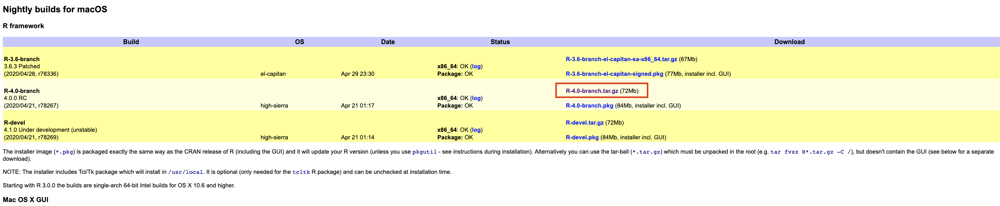
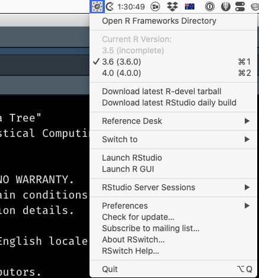

You'd have to be living under a rock in the R community to not be aware of the fact that R 4.0 has been released, with some major changes, the biggest of which is probably the new default for `read.table()`: `stringsAsFactors = FALSE`, as well as the fact that `matrix()` now converts character columns to factors and factors to integers. 

In the past, I've always been too "chicken" to try running multiple versions of R on my work laptop, as I've usually got a few key analysis projects going that need to be delivered on time and within full feature scope - which means I don't have time to fix basic version incompatibility bugs. But with this major new release I was sorely tempted, so have gone down the rabbit-hole of installing [RSwitch](https://rud.is/rswitch/guide/) and R4.0 on my Mac (Catalina 10.15.4). Below I document, in what is probably excruciating detail, the steps of how I got this to work. I've played with it for all of two days, and it seems to work - so I've written this post in the hopes of helping others. Also, I had some funky hiccups with getting the right filepath and not using sudo at the outset, so I'm hoping this helps someone avoid some extra `rm -r ...path...`

## Step 0 (CRITICAL): Close R & RStudio

Make sure you have closed R and RStudio prior to embarking on the below. Updating R versions mid-analysis can have ... unintended consequences.

## Step 1: Download RSwitch and install it

1. [Download RSwitch](https://rud.is/rswitch/) and install it. Go through all of the hoops of getting it approved by MacOS and able to be run by accepting the risks of running software from an unidentified developer. (Eventually) End up with a nice switch icon in your menubar.

## Step 2: Get new R

[As usual] There is more than one way to get a new version of R onto your machine.

#### Option 1: GUI (IMHO riskier)

Download the graphical installer `R-4.0.0.pkg`, which is the top link when on [CRAN](https://cran.r-project.org/) you click on "Download R for (Mac) OS X". This is NOT the approach I took, because if done wrong this approach can remove your existing R installation, but I will describe how in theory I think it's meant to be used below.

#### Option 2: Pre-built copy (the approach I took) 
Download a pre-built `.tar.gz` copy of the R framework from the [developer page](https://mac.r-project.org/). In my case, I downloaded the latest stable branch `R-4.0-branch.tar.gz (72 Mb)`:
    



## Step 3: Apply funky magic

#### Option 1: GUI

So the reason I think the GUI is "riskier" is because usually when you run the GUI for a new version of R, it cleanly removes the old version of R from your machine. The workaround to prevent this from happening is to make your system, and hence the R installer, "forget" it has R installed. To do this you need to open a Terminal and type the following command:

```
sudo pkgutil --forget org.r-project.R.el-capitan.fw.pkg \
             --forget org.r-project.x86_64.tcltk.x11 \
             --forget org.r-project.x86_64.texinfo \
             --forget org.r-project.R.el-capitan.GUI.pkg
```

For details about **why** this works see [here](https://cran.rstudio.org/doc/manuals/R-admin.html#Multiple-versions). 

After that completes successfully (note:  you'll need to enter your password to use sudo) you can run the GUI installer. 

#### Option 2: Command line 

I'm fairly comfortable with the command line, so was happy to use that option, but did make a few silly mistakes with the paths, so am documenting what worked below, in the hope that it helps others:

1. Use the Terminal (`cd ...`) to navigate to where you've got the `R.***.tar.gz` and record its location, or -if you already know it - just copy the path to it to the clipboard.

2. Navigate to your root directory: `cd /`

3. Run `sudo tar -xvzf path_to_R_tar.gz_file`, where `path_to_R_tar.gz_file` is the path you saved to the clipboard. After you enter your password, R should be installed and you should have the latest version of R active on your machine. 

## Step 4: Painfully battle the security stuff

Try to open Rstudio. This is probably something that happens only with Option 2 above, but I got a bunch of security warnings from MacOS and had to "Allow Anyway" a ton (twice) before RStudio was able to load R 4.0. 


Accept all the things:


## Step 5: Switch

To go back to having your existing, "production" version of R active on your machine use RSwitch to select that older version:




***
I hope this post has been helpful, and let me know in a comment if something isn't working as described or something's not clear. (Probably) next post: updating libraries...


