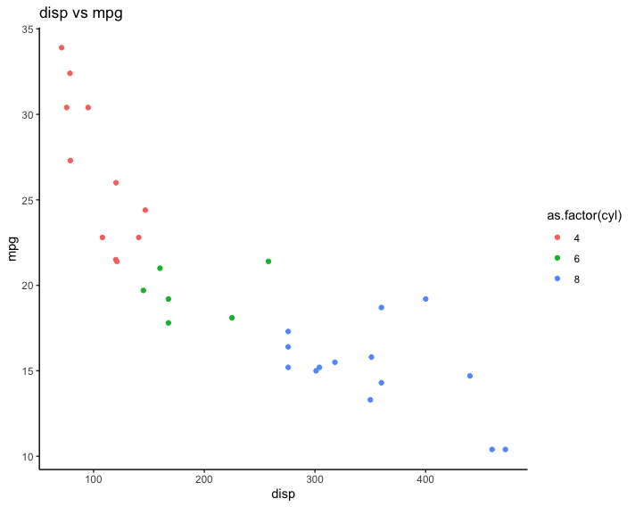
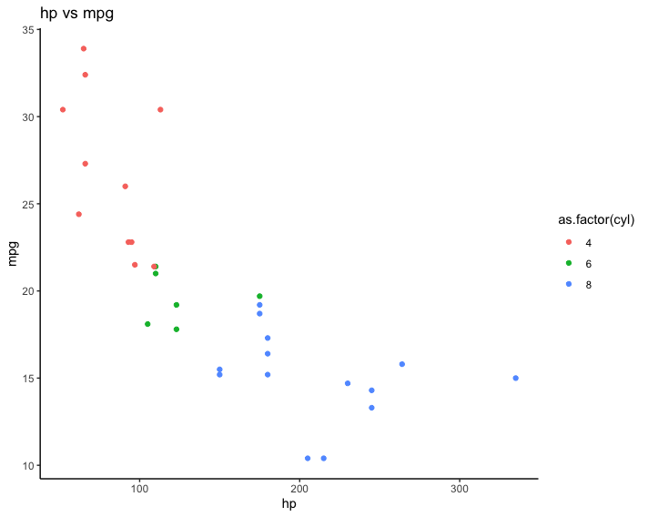
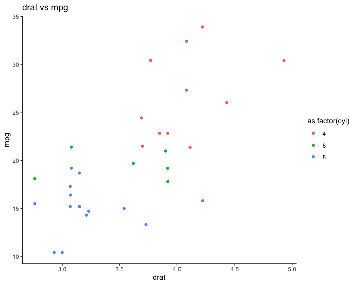

When working with data, often you want to make a specific type of plot across a bunch of variables at once. The R/tidyverse way of doing this involves some (basic) non-standard evaluation, but - because I know I'll forget how to do this in the future - I thought I'd write up this short blog post with code that works.

In the below snippet, we use ggplot on the built-in mtcars dataset to make a scatterplot of each of the variables against the `mpg` variable, colouring it by the number of cylinders (on the fly converted to a factor).

To do this, I define the `makeplots()` function, which takes a single argument called `myfeature`. Within the function, I need to save the plot as a variable (`a`), and then print it so that it is rendered in the Rmd. I grab the column names I'd like to iterate over and save them into a character vector (In real life, I tend do grab them all using `names(mtcars)`, but I choose a few manually to keep this blog post manageable. Also, I could have used commands like `setdiff()` to subset the `names(mtcars)` character vector to remove, for example, mpg itself). 

I also use the `as_label(quo(.))` functions to extract the string of the variable name itself, so I can use it to set the title of the plot.

```r
library(purrr)
library(dplyr)
library(ggplot2)
makeplots <- function(myfeature){
  a <- mtcars %>%
    select(!!myfeature, mpg, cyl) %>%
    unique() %>%
    ggplot(aes(x = !!myfeature, y = mpg, colour = as.factor(cyl))) + 
    geom_point() + 
    labs(title = paste0(as_label(quo(!!myfeature)), " vs mpg")) +
    theme_classic()
  
  print(a)
}

# to get all of the column names
# mycolnames <- names(mtcars)
# I'm using a shorter vector in the interests of not overwhelming this blog post with ALL the images
mycolnames <- c("disp", "hp", "drat")
walk(mycolnames, ~makeplots(myfeature = sym(.x))) 
```






