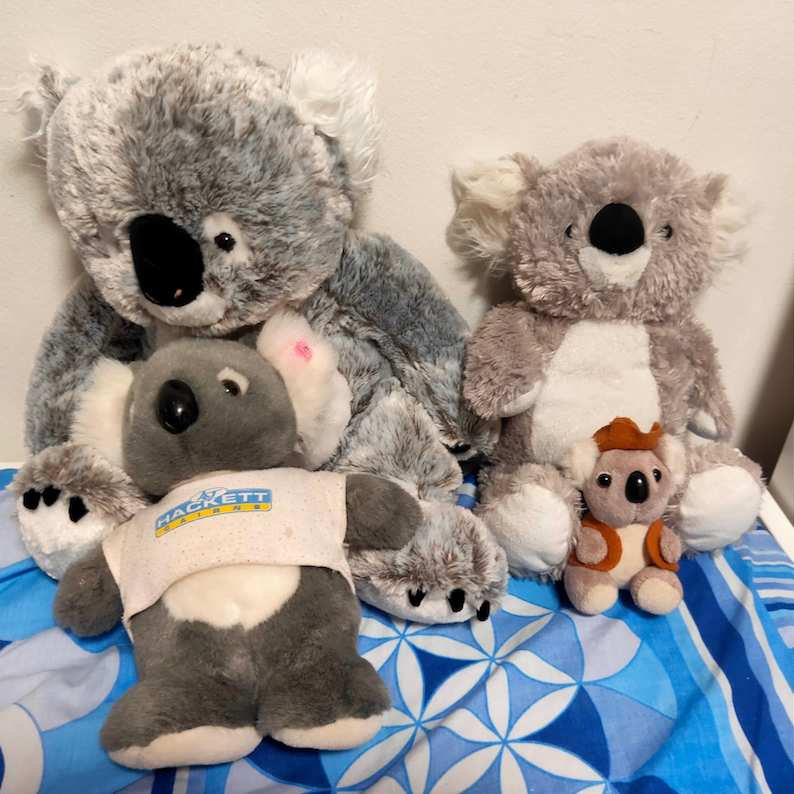
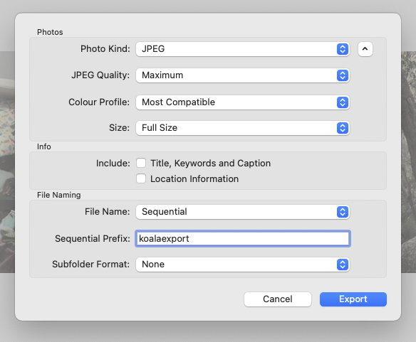
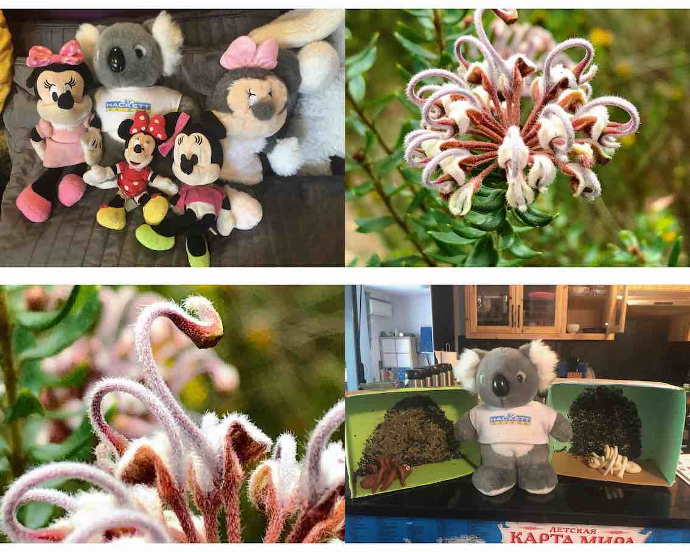
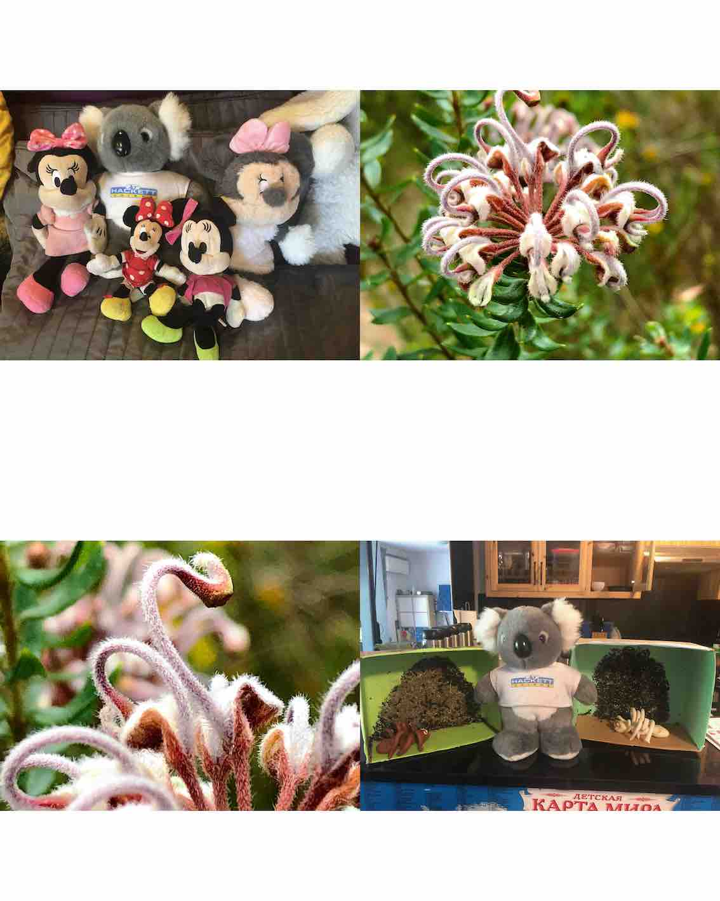

While this blog tends to focus on things I do at work or as part of data-sciency related extracurricular interests, I can't help but post the solution to an amusing problem being the parent of a preschooler threw my way. My daughter's daycare has a roaming koala (yes, a koala, because we're in Australia, y'all), who gets to spend a week with each family in turn, after which we're meant to contribute photos and some text to the "Koala's adventures" scrapbook.



*In the above image, the "Koala in a t-shirt" is the daycare one, visiting one of my daughter's friends houses, who happen to have many Koala friends...*

## Problem definition

The A4 scrapbook we were meant to use was too small to have full-sized 4x6 prints glued in, so I needed to print several images on one 4x6 card and then cut them apart. 4 images per page seemed to be the "sweet spot" in our case. 

Initially, I tried some freely available collage tools for Mac, but found them annoying, cumbersome and very out-of-date - and not really supporting bulk processing 52 images at once - so I ended up  with a command-line based solution.

## Setup

- My photo setup is pretty basic: my iPhone and its default camera app [^1]. I *think* the native dimensions of images on the iPhone are [4032 px x 3024 px](https://apple.stackexchange.com/questions/298606/what-are-the-dimensions-in-pixels-of-a-picture-taken-with-iphone-8-and-x/298608)... 

- I have an Epson EcoTank 2750 printer, which I absolutely love because it's an easily refillable colour inkjet. This makes printing all of the squizillion worksheets and handouts in my life inexpensive and reasonably fast. I recently discovered that this printer can print photos in decent quality (at least as well as you used to be able to get at the corner drugstore back when I was a child + we shot on film...), provided you buy good quality photo paper.

## Process

To solve the "Koala's adventures" dilemma we took the following steps:

### Step 1

Take hundreds of photos, on some percentage of which my child, the koala and the accompanying background/other subjects would come out well.

### Step 2

Use the default Photos app on the computer to delete the photos we didn't want, and to pick a handful of "Favourites" that we would print out and include in the scrapbook.

*As a "Pro" tip, which I've now learned because my daughter wants to make an ongoing scrapbook of her adventures even without the koala (great for language development apparently) - you can also create a custom folder where you put all of the photos for scrapbooking, and save the ones you haven't printed only to favourites.*

### Step 3
Using the Photos app, rotate all of the images to be either landscape or portrait. I will use landscape for this post.

*Yes, you could rotate them later using Preview or ImageMagick, but I prefer doing this in Photos as it allows me to bulk-select images and rotate in one keyboard stroke.*

### Step 4

Export the photos out to a folder of your choice in jpeg format, with maximum quality.



### Step 5

Rename the files in this folder to NOT have spaces in the filenames:

I'm not sure if there is an easy way to get Photos export to NOT export with spaces in filenames. This is what my Mac did:

```
-rw-r--r--@ 1 darya  macmini  8382495 31 Oct 14:48 koalaexport - 1.jpeg
-rw-r--r--@ 1 darya  macmini  9401795 31 Oct 14:48 koalaexport - 2.jpeg
-rw-r--r--@ 1 darya  macmini  8078024 31 Oct 14:48 koalaexport - 3.jpeg
-rw-r--r--@ 1 darya  macmini  8789539 31 Oct 14:48 koalaexport - 4.jpeg
```

In order to get rid of those spaces, open a `Terminal` session in the same folder you've just saved your photos in and run the following command.

```sh
for file in *; do mv "$file" `echo $file | tr ' ' '_'` ; done
``` 

This will result in the following:
```
-rw-r--r--@ 1 darya  macmini  8382495 31 Oct 14:48 koalaexport_-_1.jpeg
-rw-r--r--@ 1 darya  macmini  9401795 31 Oct 14:48 koalaexport_-_2.jpeg
-rw-r--r--@ 1 darya  macmini  8078024 31 Oct 14:48 koalaexport_-_3.jpeg
-rw-r--r--@ 1 darya  macmini  8789539 31 Oct 14:48 koalaexport_-_4.jpeg
```

### Step 6 

Next, you'll need to arrange the photos on a 2x2 card grid. You can do this using [ImageMagick](https://imagemagick.org/index.php)'s [montage](https://imagemagick.org/script/montage.php) command [^2].

I originally wrote this command to work on 52 images, and it looked like this:

```sh
for ((i=0;i<=12;i++)); do montage -geometry 1800x1200+0+0 -tile 2x2 koalaexport_-_$(( 4*i + 1 )).jpeg koalaexport_-_$(( 4*i + 2 )).jpeg koalaexport_-_$(( 4*i + 3 )).jpeg koalaexport_-_$(( 4*i + 4 )).jpeg ${i}.tiff;done
```

To break down what's going on, let's start with that `for` loop:

```
for ((i=0;i<=13;i++)); do echo $i;done
```
This prints the numbers 0 to 13 to the console.

What I'm then doing, is using the shell to do math; in every loop iteration, I'm retrieving the following numbers, and using them to access the corresponding filenames
-  `$((4*i + 1))`, i.e. `1`,`5`,`9`...
-  `$((4*i + 2))`, i.e. `2`,`6`,`10`...
-  `$((4*i + 3))`, i.e. `3`,`7`,`11`...
-  `$((4*i + 4))`, i.e. `4`,`8`,`12`...

This allows me to access the input files in batches of 4, and the output files in iterations of 1.
***

The basic command we have "within" that loop is `montage -geometry 1800x1200+0+0 -tile 2x2 image1.jpg image2.jpg image3.jpg image4.jpg 1.tiff`, where:

- `-tile 2x2` is saying that we want to tile the images, with 2 wide and 2 across
- `image1.jpg image2.jpg image3.jpg image4.jpg` -> are the four input files
- `1.tiff` is the output tiff file we'll use for printing
- The `-geometry` flag is saying how we want our final canvas to be:
  - 1800 pixels wide (6 inches at 300 dpi == 1800 pixels minimum) [^3]
  - 1200 pixels high (4 inches at 300 dpi == 1200 pixels minimum) 
  - the `+0+0` is saying that we don't want any kind of a border around each of the images, i.e. we want the jpegs printed all next to each other.




Another tip, in case you start getting issues where your images end up having too much white space and look something like this:



Is to either:
- Use the `-rotate 90` flag OR
- Change the order of the first two numbers in the geometry command, i.e. if it was `-geometry 1800x1200+0+0` change it to `-geometry 1200x1800+0+0`

Hopefully this posts helps in getting started with using ImageMagick to batch-collage files, for all of your scrapbooking needs. If you have any questions or something ends up unexpected, please leave a comment below.


[^1]: Yes, I will occasionally use [Camera+ 2](https://camera.plus/) when I'm feeling fancy or want to do some macro photography, but this usually occurs when my daughter is not in tow.

[^2]: If you don't have ImageMagick installed on your Mac, I *highly* recommend using [homebrew](https://brew.sh/) to install it: `brew install imagemagick`

[^3]: I have read online that you are meant to have 300 dpi (dots per inch) to get good quality for printing, which is why I've set the resolution to be this, BUT there are also articles such as [this](http://www.rideau-info.com/photos/whatisdpi.html) one which suggest that my mental model is probably simplistic. However, this resolution worked to get good quality images for me for printing.