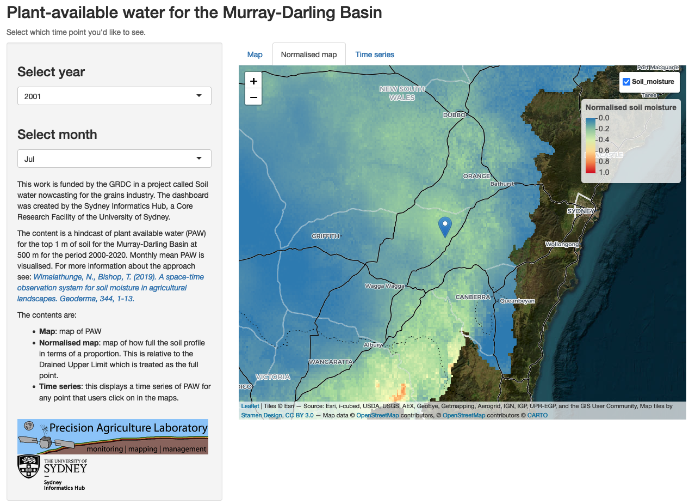

{fig-align="center" width=80%}

## Clients

- [Prof Thomas Bishop](https://www.sydney.edu.au/science/about/our-people/academic-staff/thomas-bishop.html), [Sydney Institute of Agriculture](https://www.sydney.edu.au/agriculture/), University of Sydney

## Purpose

- The client had a hindcast of plant available water (PAW) for the top 1 m of soil for the Murray-Darling Basin at 500 m for the period 2000-2020.
- The Grains Research and Development Corporation (GRDC) funded a project to visualise this modelling data for farmers and stakeholders.

## Approach

- Built an R-Shiny dashboard to present this geospatial data, including creating custom scaling functionality that supports increasing image resolution as a user zooms in to an area of interest.
- Data is hosted on AWS Cloud infrastrucure (S3) - so optimised data structure to support rapid serving of results.
- App is deployed to [shinyapps.io](https://pahgisl.shinyapps.io/shinyapp/).

## Outcome

- Project was funded by GRDC, bring in $35000 to SIH.
- Success of project resulted in acquiring competitive funding for an additional 18 month position at SIH, to create real-time modelling infrastructure and deployment of the results to cloud infrastructure. Value of this additional funding is over $250 000.

## Links

- [Shiny Dashboard](https://pahgisl.shinyapps.io/shinyapp/)

## Key tools

- *R: R-Shiny terra, sf, ncdf4, stars, raster, leaflet, leafem, tidyverse, rgdal; Git + GitHub*.
  