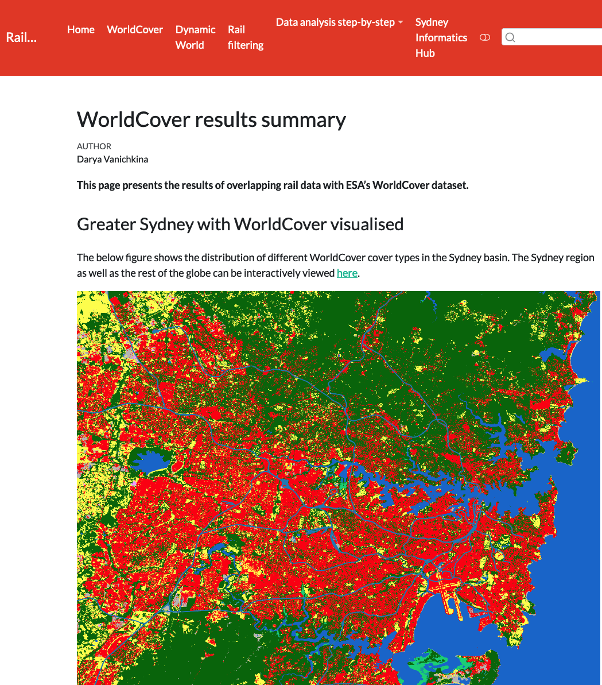

{fig-align="center" width=80%}

## Clients

- [Professor Dieter Hochuli](https://www.sydney.edu.au/science/about/our-people/academic-staff/dieter-hochuli.html), [Sydney Environment Institute](https://www.sydney.edu.au/sydney-environment-institute/), University of Sydney
- [Associate Professor Kurt Iveson](https://www.sydney.edu.au/science/about/our-people/academic-staff/kurt-iveson.html), [Sydney Environment Institute](https://www.sydney.edu.au/sydney-environment-institute/) & [Sydney Southeast Asia Centre](https://www.sydney.edu.au/sydney-southeast-asia-centre/), University of Sydney

## Purpose

- Clients had observed that in some parts of Sydney the rail corridor provides pockets of valuable habitat for native wildlife.
- They were interested in finding out whether we could quantify the overall proportion of such possible habitats in the rail corridor in the Sydney Basin.

## Approach

- Identified and retrieved optimal geospatial datasets for carrying out this analysis, including government and open street map railway annotations and two models of land cover.
- Overlapped railways with lot annotations, and carried out substantial data cleaning to remove artifacts such as tunnels, bridges, model railways etc.
- Replicated ArcGIS approach to polygon overlaps in R (a surprisingly non-trivial task).
- Built a dynamic website so clients could browse and share results with stakeholders, as well as view what had been filtered.

## Outcome

- Project was funded by clients.
- Other results still under embargo.

## Links

- Still under embargo.

## Key tools

- *R: terra, sf, exactextractr, rgdal, leaflet, tidyverse, janitor, skimr, htmlwidgets, plotly; Git + GitHub*.
  