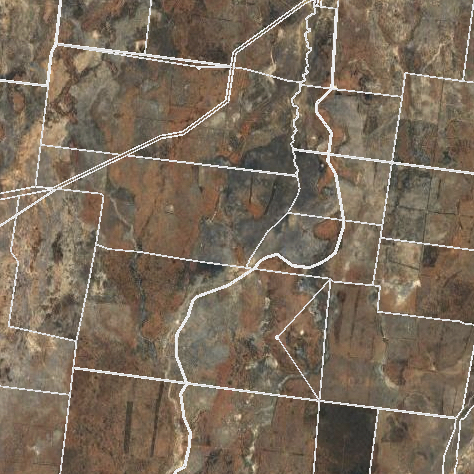

{fig-align="center" width=80%}

## Client

- Ecology researcher at the University of Sydney

## Purpose

- To provide researcher with 30+ years worth of clean data for modeling.

## Approach

- Scraped 30 years of vegetation data , comparing discrepancies between scrapes & identifying correct data by overlapping with BOM records.
- Used a high-performance computing cluster to download, crop and process 30 years worth of satellite imagery as input for machine learning.
- Provided client with documentation, instructions for rerunning the scrapes if needed & data.
## Outcome

- Client has subsequently engaged SIH for a comissioned project.

## Key tools

- *R: Rmarkdown, tidyverse, sf, raster, tmap, jsonlite, data.table; Git + GitHub*